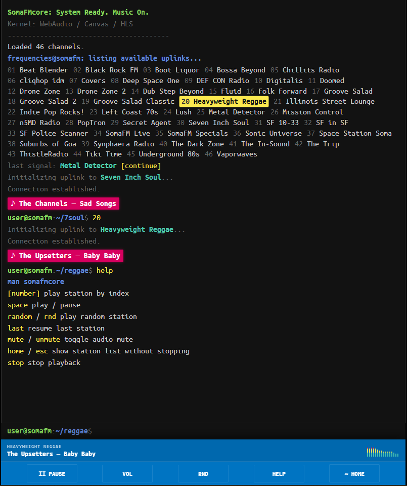

# SomaFM Core

> Poor Man's Radio for Everyone.

SomaFM Core is a terminal-style web radio player for SomaFM and a small curated set of independent external stations. It runs as a plain browser page and can also be wrapped as an Android / Google TV APK from the same `index.html`.

**🔊 Live: [https://domrique.github.io/somafm-core/](https://domrique.github.io/somafm-core/)**

Language: **English** / [Русский](README.ru.md)



## Features

- Terminal UI with typed commands, clickable station list and bottom controls.
- SomaFM channel loading from the public API with a built-in fallback list.
- Curated external radio block for independent, underground and non-mainstream streams.
- AAC / MP3 / HLS playback with Web Audio visualizer.
- Now-playing metadata for SomaFM and supported external ICY streams.
- Last station restore via `last` / `resume`.
- Random station playback via `random` / `rnd`.
- Android / Google TV build with D-pad friendly controls.

## Run

### Live

Open the GitHub Pages build:

[https://domrique.github.io/somafm-core/](https://domrique.github.io/somafm-core/)

### Local Web

Open `index.html` in any modern browser.

### Android APK

The web app and APK use the same source file: `index.html`.

Download the latest APK:

[SomaFMCore-player-release.apk](https://github.com/domrique/somafm-core/releases/latest/download/SomaFMCore-player-release.apk)

To build the release APK in this workspace:

```powershell
npm install
npm run package:release
```

Artifacts:

```text
dist/web/index.html
dist/android/SomaFMCore-player-release.apk
```

More details are in [ANDROID.md](ANDROID.md).

## Controls

You can use the bottom bar, click a station, use keyboard / D-pad, or type commands into the terminal prompt.

| Command / Key | Action |
| :--- | :--- |
| `[number]` | Play a station by list number. |
| `space` | Play / pause. |
| `home` / `back` / `esc` | Show the station list without stopping playback. |
| `random` / `rnd` | Play a random station. |
| `last` / `resume` | Continue the last station. |
| `mute` / `unmute` | Toggle audio mute. |
| `stop` | Stop playback completely. |
| `help` / `man` | Show the short command reference. |
| Arrow keys / D-pad | Move focus on TV-style controls. |
| Enter / OK | Activate the focused station or button. |

## Project Layout

- `index.html` - the application source for browser and APK.
- `index.somafm-only.html` - backup version without external radio.
- `assets/screenshot-main.png` - README screenshot.
- `android/` - Capacitor Android project.
- `scripts/` - build, packaging and Android asset scripts.
- `RADIO_CANDIDATES.md` - radio stations to recheck later.
- `ANDROID.md` - Android / Google TV build notes.

## Tech Stack

- HTML5 / CSS3
- Vanilla JavaScript
- Web Audio API
- Canvas
- hls.js
- SomaFM public API
- Capacitor Android

---

Created for personal listening and tinkering. SomaFM streams are provided by [SomaFM](https://somafm.com/); external streams belong to their respective stations.
